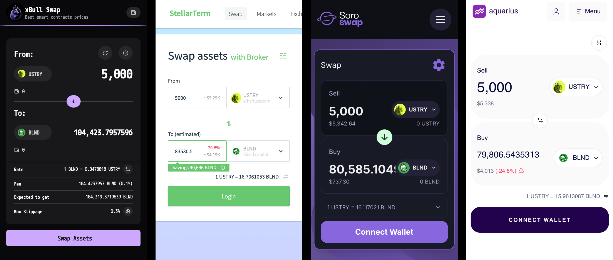

# xBull Swap's Kit

xBull Swap is a Stellar AMM Router that lets you find the best rate available across Stellar Smart Contracts by
combining the liquidity available across all popular protocols.

With this simple library, you can interact with our API to find the best route for your swap. It doesn't matter the kind
of pool or the protocol; you will get the best path across them with the best rate available across contracts.



## Install the package

```shell
npx jsr add @xbullcorp/swap-kit
```

## Start the kit

To use the kit, you only need to create a new instance of the `SwapKit` class. The class accepts some parameters like
the RPC url you want to use or the network, but if you don't provide any parameters, it will just use the default ones.

```ts
import { type QuoteResult, type StrictSendResult, SwapKit } from "@xbullcorp/swap-kit";

const kit: SwapKit = new SwapKit();
```

## Make a Swap

The most important methods are the "send" calls, these are the ones that work like the popular "path payments" in
Stellar.

```ts
const {transactionXDR}: StrictSendResult = await kit.strictSend({
  source: "G_ACCOUNT",
  fromAsset: "CAS3J7GYLGXMF6TDJBBYYSE3HQ6BBSMLNUQ34T6TZMYMW2EVH34XOWMA",
  toAsset: "CCW67TSZV3SSS2HXMBQ5JFGCKJNXKZM7UQUWUZPUTHXSTZLEO7SJMI75",
  amount: "100000000000",
  minToReceive: "18682958256",
});
```

Now you can sign the transaction with the method of your preference and submit the transaction to the network. Our API
will take care of generating the transaction with the correct values and even trusting an asset if the account doesn't
do it yet.

### Smart Wallets support

Our API and Library support Smart Wallets, you only need to specify the `source` and `from` values where you will use
a "G" account as the `source` and a "C" account for the `from` value.

> Currently, the protocol only supports "Strict Send" type payments.

## Get a Quote

There will be cases where you only want to know the amount of a swap without actually wanting to generating the
transaction at the moment. For that you can get a quote from our API.

```ts
const quote: QuoteResult = await kit.quote({
  fromAsset: "CAS3J7GYLGXMF6TDJBBYYSE3HQ6BBSMLNUQ34T6TZMYMW2EVH34XOWMA",
  toAsset: "CCW67TSZV3SSS2HXMBQ5JFGCKJNXKZM7UQUWUZPUTHXSTZLEO7SJMI75",
  amount: "100000000000",
});
```

At this point, if you want to execute this quote, you can generate the transaction with a "send" method like before, but
providing the quote's route instead, like this:

```ts
const swap: StrictSendResult = await swapKit.strictSend({
  source: "G_ACCOUNT",
  route: quote.route,
  amount: "100000000000",
  minToReceive: "18682958256",
});
```

## Fetch the supported assets

Our protocol doesn't support all assets available on the network because not all of them have sufficient liquidity
across smart contracts to benefit from our tool, you can get the list of support assets like this:

```ts
const assets: AssetsListResult = await kit.assetsList();
```
